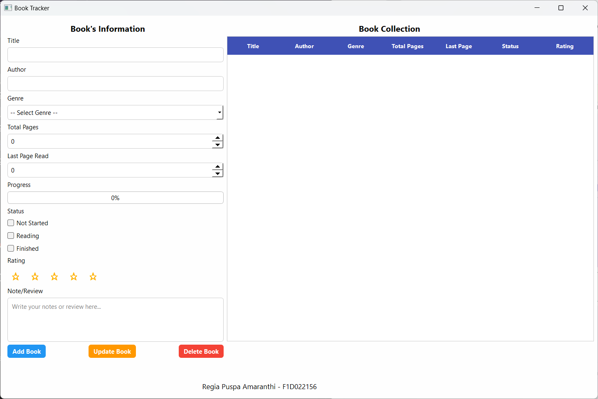
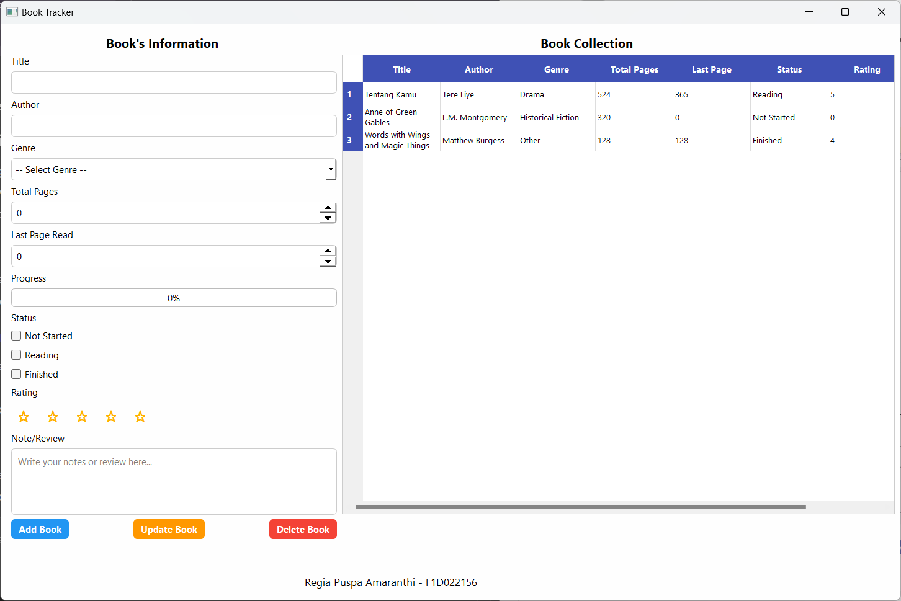
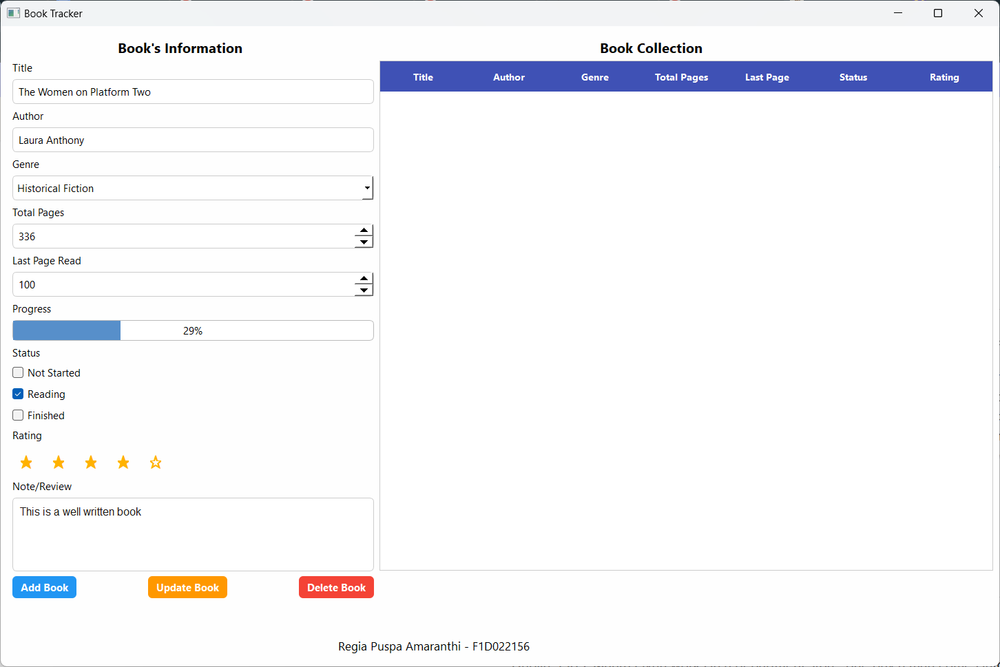
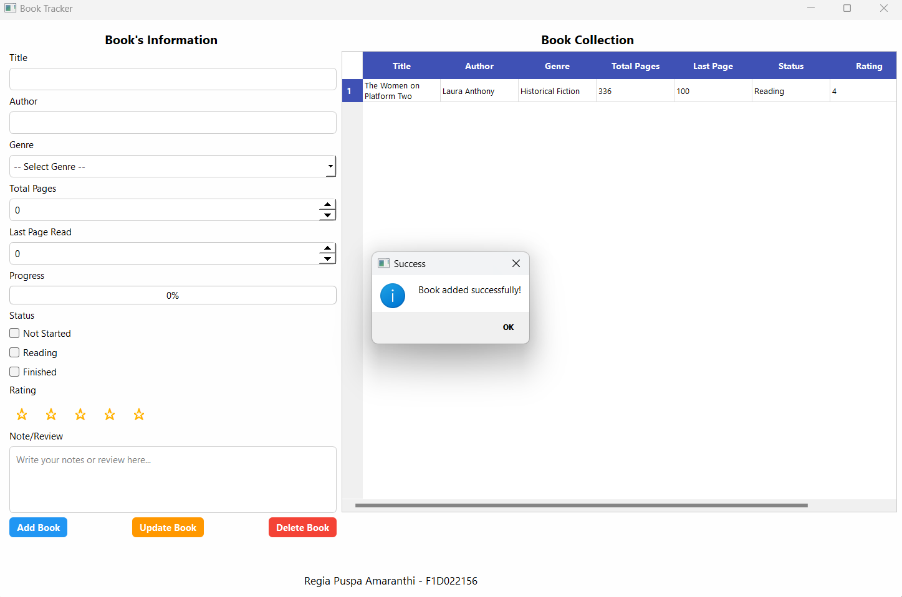
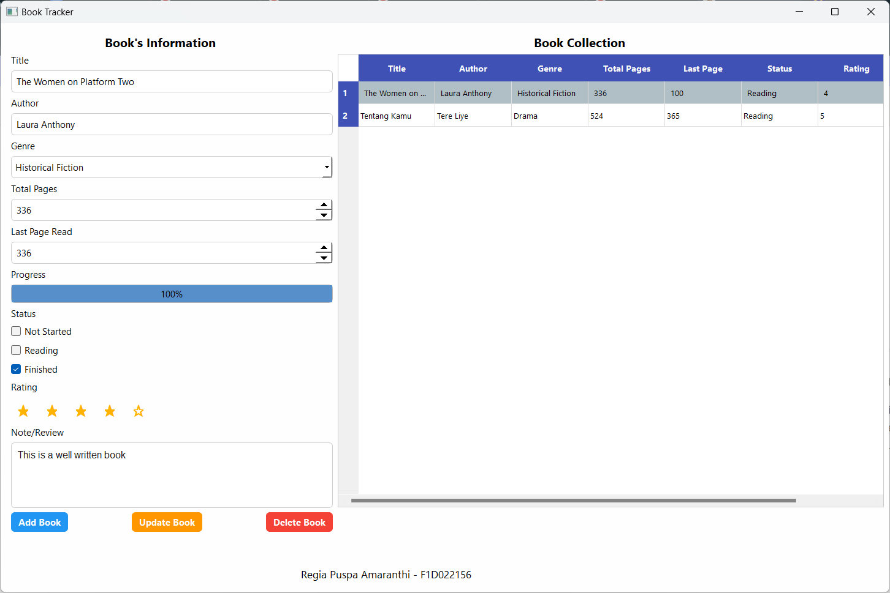
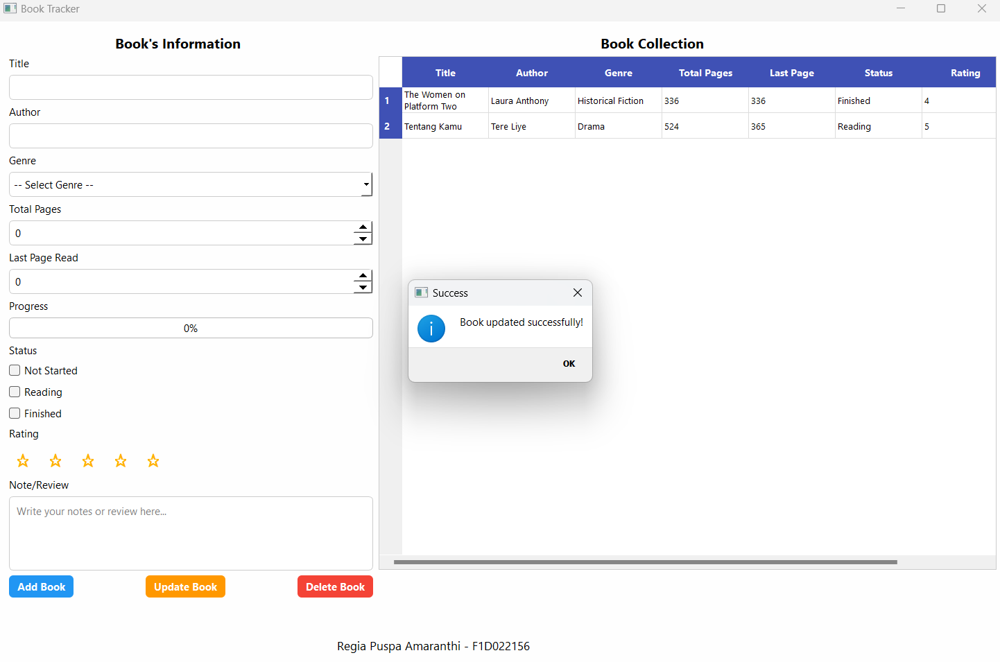
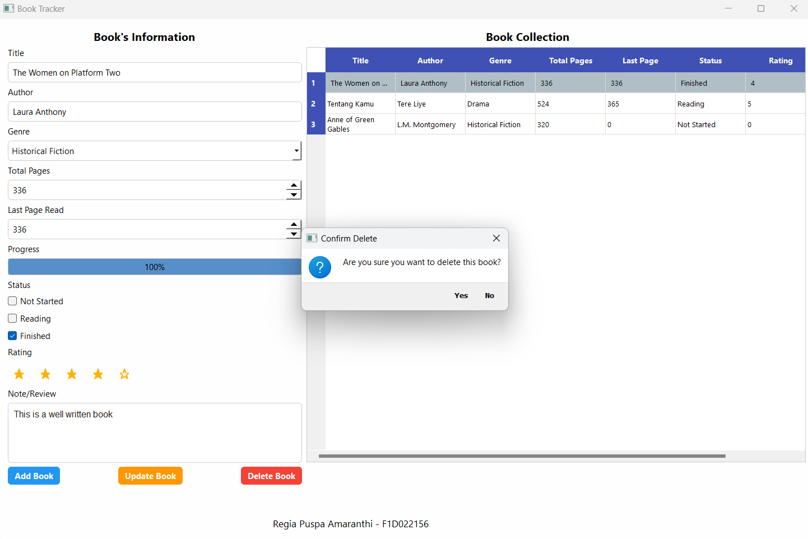
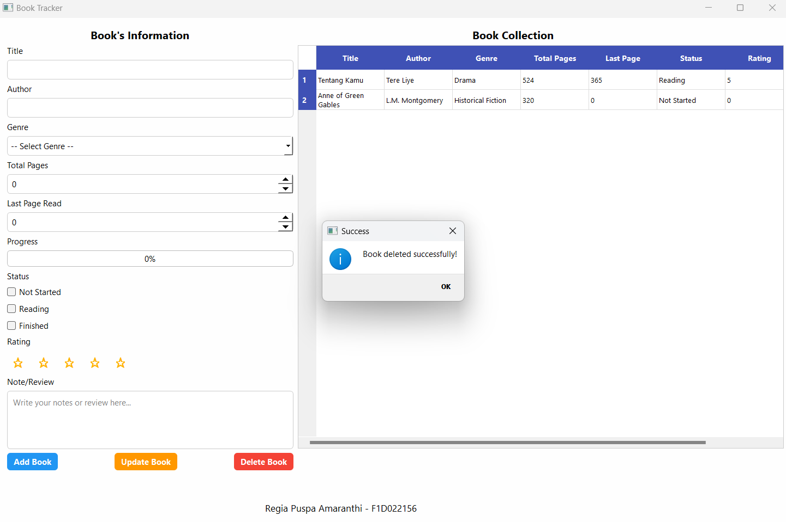
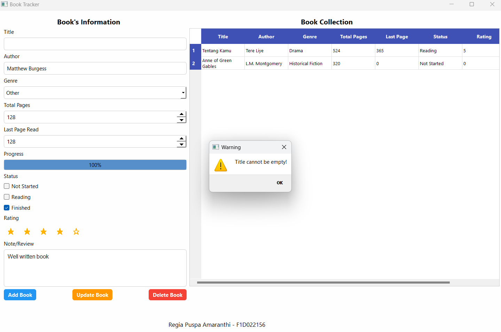

<table align="center">
  <tr>
    <td align="center">
       
      <b>Tampilan Utama Aplikasi</b>
    </td>
    <td align="center">
       
      <b>Tampilan Utama Aplikasi</b>
    </td>
  </tr>
  <tr>
    <td align="center">
       
      <b>Menambahkan Buku Baru</b>
    </td>
    <td align="center">
       
      <b>Notifikasi Berhasil Menambahkan Buku</b>
    </td>
  </tr>
  <tr>
    <td align="center">
       
      <b>Memperbarui Data Buku</b>
    </td>
    <td align="center">
       
      <b>Notifikasi Berhasil Memperbarui Data Buku</b>
    </td>
  </tr>
  <tr>
    <td align="center">
       
      <b>Menghapus Buku</b>
    </td>
    <td align="center">
       
      <b>Notifikasi Berhasil Menghapus Buku</b>
    </td>
  </tr>
  <tr>
    <td align="center">
       
      <b>Validasi Data Input</b>
    </td>
  </tr>
</table>
